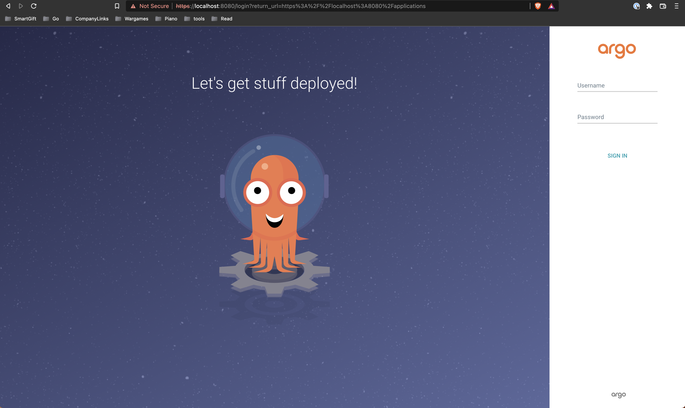
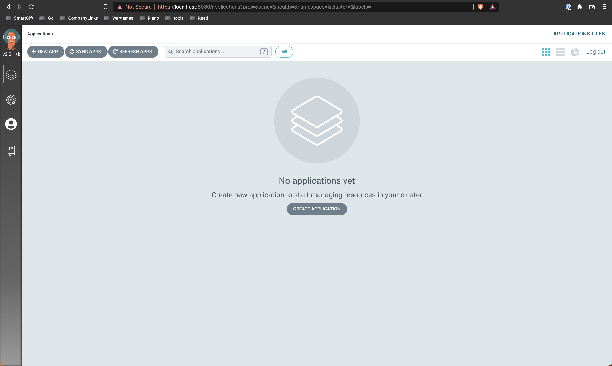
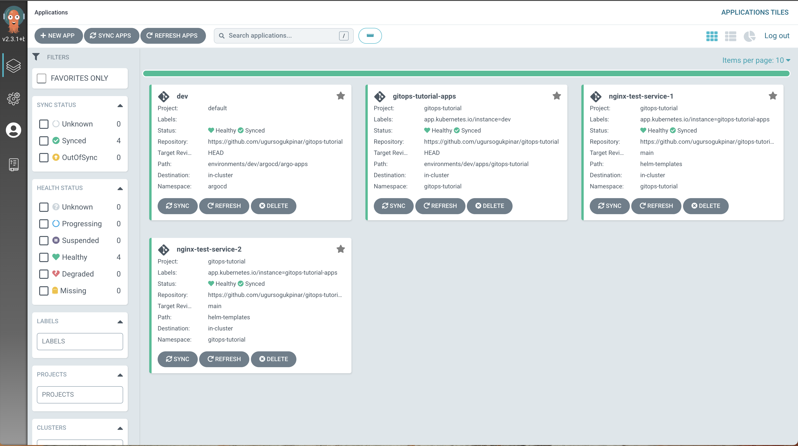

# gitops-tutorial
This repository is created to provide a boilerplate to build an example continues delivery platform by using [ArgoCD](https://argo-cd.readthedocs.io/en/stable/) and [Helm](https://helm.sh/).


## ToDos
- [ ] Add an example to show secret management.
- [ ] Add an AWS deployment guide.
- [ ] Create a Turkish documentation.

## Installation


#### Requirements
-  A kubernetes cluster. It can be created locally by using one of options below.
    * [Docker Desktop](https://www.docker.com/products/docker-desktop/)
    * [minikube](https://minikube.sigs.k8s.io/docs/start/)
- [kubectl](https://kubernetes.io/docs/tasks/tools/#kubectl)
<!-- - [helm](https://helm.sh/docs/intro/install/) -->


#### ArgoCD Installation

> You can follow the official documentation [here](https://argo-cd.readthedocs.io/en/stable/getting_started/)


a. ArgoCD Installation

```bash
# Create the namespace for argocd.
$ kubectl create namespace argocd

# Add ArgoCD objects to your K8s cluster.
$ kubectl apply -n argocd -f https://raw.githubusercontent.com/argoproj/argo-cd/stable/manifests/install.yaml

# Wait until all the argocd pods are up & running 
$ kubectl get pods -n argocd

# You need to use port-forwarding to expose argocd-server.
kubectl port-forward svc/argocd-server -n argocd 8080:443
```

ArgoCD must be accesable on https://localhost:8080. 

> **_NOTE:_** ArgoCD redirects http requests to https, don't mind the SSL issue on the browser.



The initial password for the `admin` account is autogenerated and it needs to be pulled from kubernetes secrets.

```bash
$ kubectl -n argocd get secret argocd-initial-admin-secret -o jsonpath="{.data.password}" | base64 -d; echo
```

Once you input the credentials, you will see the ArgoCD UI.


b. Installing the master app

ArgoCD has an ability to bootstrapping all applications from one entrypoint, We will only create the master application by hand and rest will be handled by argocd.

```bash
$ kubectl apply -f environments/dev/argocd/application.yaml -n argocd
```

Once it is applied, you will see all the applications are created.



